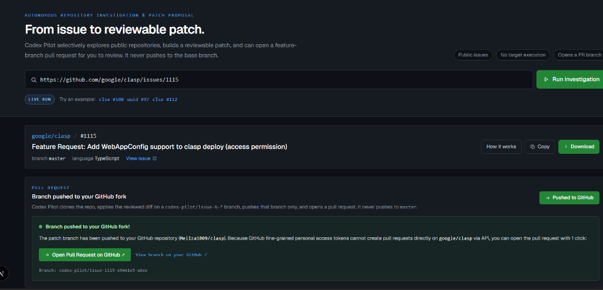
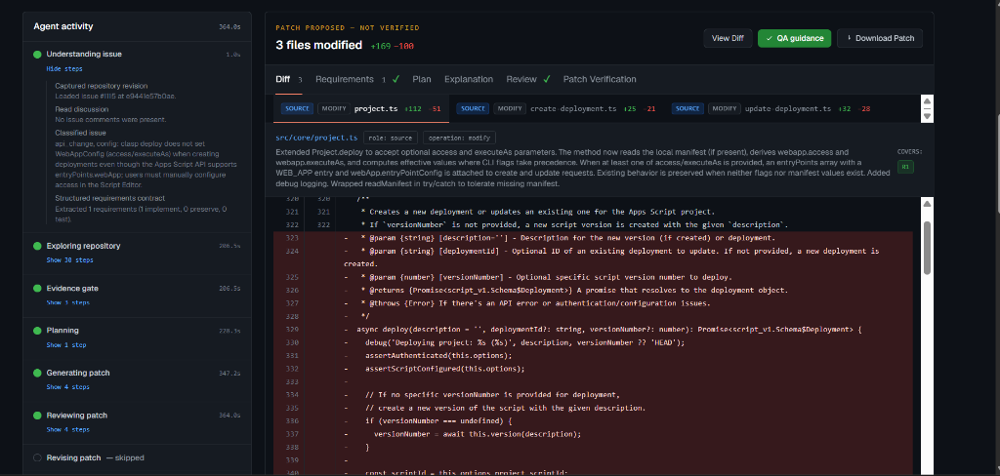
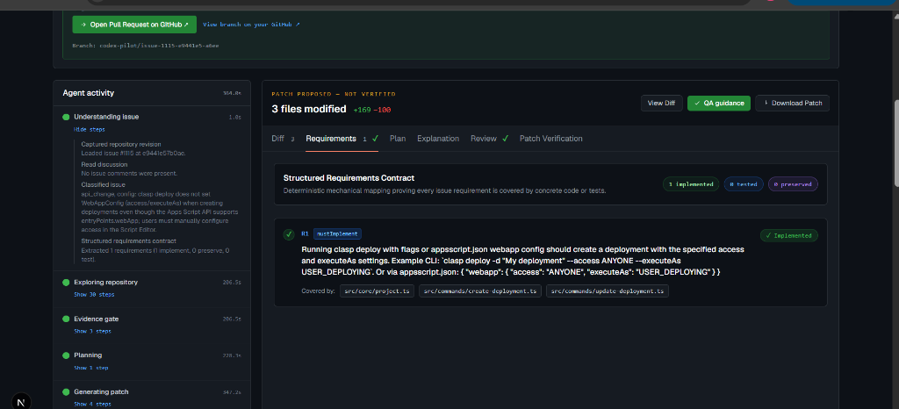
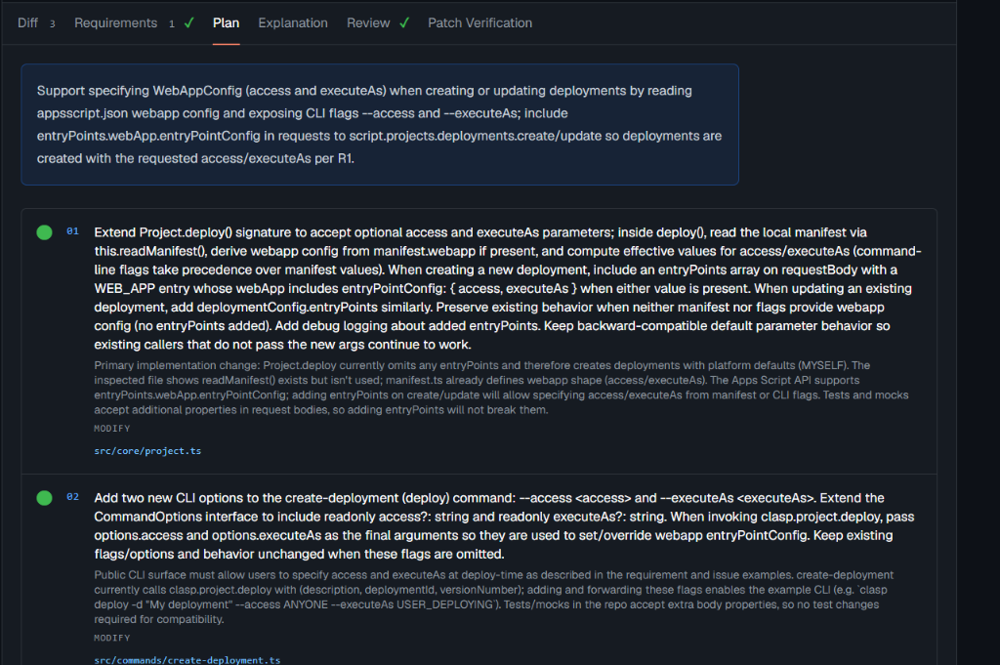
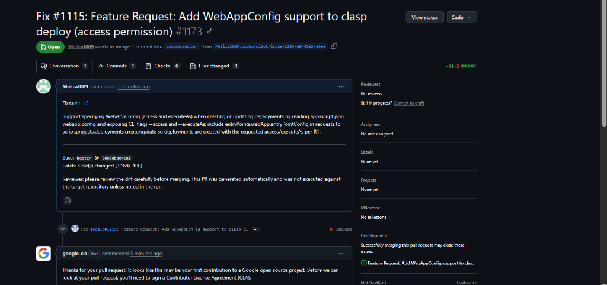

# Codex Pilot

Codex Pilot turns a public GitHub issue into a focused, reviewable patch proposal. It reads the issue discussion and a bounded set of repository files, asks an AI engine for structured analysis and edits, validates the proposed changes, and presents a unified diff for review.

The project produces a reviewed patch proposal. It does not execute target-repository code or claim that the patch passes the target repository's tests.



## Screenshots & Workflow Walkthrough

| View | Preview | Description |
| :--- | :--- | :--- |
| **Investigation & Fork PR** | [](public/screenshots/01-overview-pr-fork.png) | Paste any public issue URL, watch autonomous investigation, and push to your fork with 1-click PR opening. |
| **Agent Activity & Unified Diff** | [](public/screenshots/02-agent-activity-diff.png) | Step-by-step agent lifecycle (exploration, planning, patch generation, review) and live unified diffs. |
| **Requirements Contract** | [](public/screenshots/03-requirements-contract.png) | Mechanical mapping ensuring every issue requirement (`mustImplement`, `preserve`, `test`) is covered. |
| **Implementation Plan** | [](public/screenshots/04-implementation-plan.png) | Multi-step implementation plan with exact file operations before code editing begins. |
| **Pull Request on GitHub** | [](public/screenshots/05-github-pr-opened.png) | Automated feature branch pushed to fork and opened against upstream repository with full context. |


## Run locally

```powershell
npm install
Copy-Item .env.example .env.local
codex login
npm run dev
```

Open <http://localhost:3000> and paste a public GitHub issue URL.

Set `GITHUB_TOKEN` in `.env.local` if GitHub's unauthenticated API rate limit is too restrictive. Keep `.env` and `.env.local` private; both are ignored by Git.

## Configuration

The most useful local settings are:

```dotenv
# Live investigations
CODEX_PILOT_LIVE_RUNS=true
NEXT_PUBLIC_CODEX_PILOT_LIVE_RUNS=true

# Optional GitHub read token
GITHUB_TOKEN=

# Optional PR publishing
CODEX_PILOT_ALLOW_PR=false
CODEX_PILOT_PR_MODE=fork
GITHUB_PR_TOKEN=
```

PR publishing is disabled by default. To enable it, set `CODEX_PILOT_ALLOW_PR=true` and provide a token with the required GitHub access. Branch mode pushes to the target repository and requires write access there. Fork mode pushes a feature branch to your fork and opens a PR against the upstream repository; it is the appropriate mode for repositories you do not own. If automatic fork creation is rejected, create the fork on GitHub once and retry.

For public upstream repositories, a classic GitHub token with the `public_repo` scope is often the simplest option for fork publishing. Fine-grained tokens must be authorized for the resources and repository permissions used by the operation.

## Hosting modes

- **Local live demo:** leave `CODEX_PILOT_LIVE_RUNS` enabled, authenticate the local Codex CLI with `codex login`, and run `npm run dev`.
- **Hosted sample preview:** set both `CODEX_PILOT_LIVE_RUNS=false` and `NEXT_PUBLIC_CODEX_PILOT_LIVE_RUNS=false` at build time. The preview shows sample data and refuses live investigations and PR publishing.

## Investigation workflow

1. Read the issue, comments, repository metadata, and the current default-branch commit.
2. Explore a bounded set of relevant files and search results.
3. Build a structured requirements contract and implementation plan.
4. Ask the selected AI engine for complete file replacements within the approved plan.
5. Generate the unified diff in the application and run deterministic scope and consistency checks.
6. Run a separate patch-review pass that checks requirement coverage, unrelated changes, likely syntax risk, API risk, and evidence support.
7. Display the patch, explanations, review record, limitations, and downloadable diff.

The local Codex CLI runs with an ephemeral read-only sandbox and its shell tool disabled. The OpenAI API engine uses strict structured output. The browser stores engine settings locally; API keys are sent for the current run and are not stored or logged by the server.

## Verification boundary

Codex Pilot captures the analyzed commit and validates that the patch is structurally applicable, but it does not clone and execute arbitrary target repositories. The UI therefore labels the result **PATCH PROPOSED - NOT EXECUTED**. Apply the downloaded patch in an approved development environment and run the repository's own build, lint, and test commands before merging.

## Pull-request workflow

After the review is approved and the consent checkbox is selected, the local PR flow:

1. Clones the repository into a temporary workspace.
2. Creates a `codex-pilot/issue-N-*` feature branch.
3. Applies and checks the reviewed patch.
4. Commits and pushes the feature branch only.
5. Creates the PR through the GitHub API.
6. Removes the temporary workspace.

The base branch is never pushed. In fork mode, the feature branch is pushed to your GitHub fork (`forkOwner/repo`). If upstream PR creation via API is restricted by token permissions (such as fine-grained PAT scopes on external repositories), Codex Pilot displays the pushed branch and provides a direct 1-click comparison link to open the pull request on GitHub with pre-filled title and description.

## Logs and saved runs

Open `/logs` or use the **Logs** button to inspect live server activity, failure codes, and PR events. Secrets are redacted, and the in-memory log buffer keeps the most recent 500 entries per server instance.

Completed runs are saved in the browser's `localStorage` and restored after navigation or reload. An in-progress run cannot be resumed after leaving the page. Use **Clear** to remove saved runs from the browser.

## Tests

Run the deterministic regression suite with:

```powershell
npm test
```

The suite covers issue-to-plan-to-patch contracts, revision pinning, bounded revisions, patch persistence, PR-flow behavior, log redaction, provider handling, and manual-QA-only verification.

If the investigator cannot establish enough evidence or produce a supported, scoped edit, it refuses to publish an empty or ungrounded patch. Rate limits, private repositories, missing repositories, closed issues, unsupported files, and oversized repositories receive dedicated failure states.
