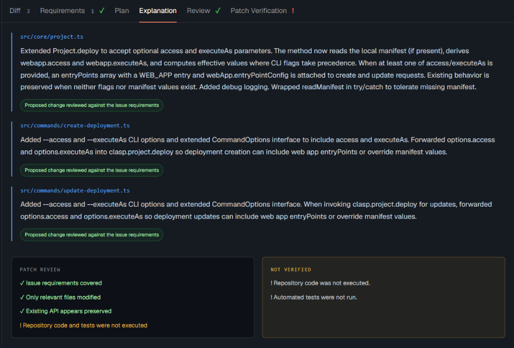
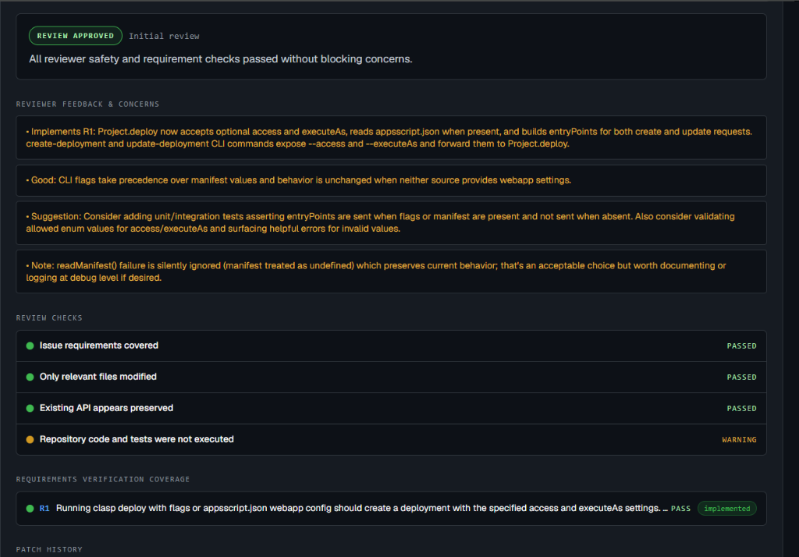
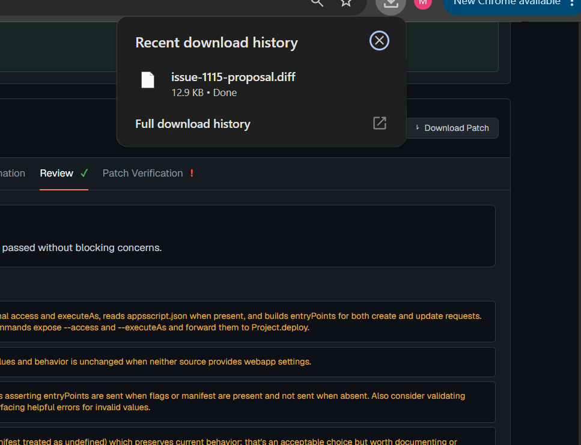

# Codex Pilot

> Autonomous GitHub Issue Solver & Patch Proposer

[](https://drive.google.com/drive/folders/1dKBSR1pNRw1YZZmcVvqijf8pqgp2Ga-y?usp=sharing)
[](https://github.com/Meliza1009/codex-pilotv2)
[-000000?style=for-the-badge&logo=next.js&logoColor=white)](https://nextjs.org/)
[](https://www.typescriptlang.org/)


---

## Overview

**Codex Pilot** is an autonomous AI developer assistant that turns a public GitHub issue into a focused, verifiable, and reviewable patch proposal. 

Given an issue URL, Codex Pilot reads the discussion thread and repository metadata, autonomously explores candidate source files, builds a formal requirements contract and implementation plan, queries an AI engine for structured edits, validates the unified diff, runs an independent multi-check patch review, and pushes a feature branch to your GitHub fork with 1-click Pull Request creation.

The project produces a reviewed patch proposal. It does not execute target-repository code or claim that the patch passes the target repository's tests.

---

## Problem Statement

Contributing to open source or resolving complex bugs in unfamiliar codebases is slow, cognitively demanding, and prone to pitfalls:

1. **High Cognitive Load & Context Traversal**: Developers must manually locate relevant files across thousands of lines of code and trace unfamiliar dependencies just to understand an issue.
2. **AI Hallucinations & Scope Creep**: Standard LLMs often produce incomplete snippets, touch unrelated files, invent nonexistent APIs, or violate architectural boundaries.
3. **Manual PR Overhead**: After identifying a fix, developers must fork, clone, create feature branches, format patches, commit, push, and open pull requests—a repetitive multi-step workflow.
4. **Target Execution Security Risks**: Blindly executing untrusted target-repository code or scripts during investigation introduces severe security vulnerabilities.

---

## Solution

Codex Pilot introduces a structured, safe, and transparent pipeline from issue URL to upstream pull request:

- **Bounded Multi-Round Exploration**: Scans repository trees and performs focused symbol searches with evidence gates to ground every proposed edit in real source code.
- **Formal Requirements & Planning Contract**: Deconstructs issues into explicit requirements (`mustImplement`, `preserve`, `test`) and drafts a step-by-step plan before touching code.
- **Independent Patch Review**: An automated review pass verifies requirement coverage, flags API breakage risks, ensures no unrelated files were touched, and checks syntax sanity.
- **Non-Executing Safety Boundary**: Analyzes and constructs patches without executing arbitrary target-repository code, providing downloadable `.diff` files for developer-side QA.
- **Fork-Aware PR Publishing**: Creates ephemeral git workspaces, pushes feature branches exclusively to user forks (never touches base branches), and provides 1-click PR comparison links even when using scoped fine-grained tokens.

---

## Features

- 🔍 **One-Click Issue Ingestion**: Paste any public GitHub issue URL to trigger autonomous repository indexing and discussion analysis.
- 🧭 **Bounded Exploration & Evidence Gates**: Progressively explores candidate files with early-exit thresholds to ensure factual grounding.
- 📋 **Structured Requirements Contract**: Mechanical mapping ensuring all criteria are categorized and covered by the patch.
- 📐 **Rigorous Implementation Planning**: Pre-validates planned file operations (`modify`, `create`, `delete`) before code generation.
- 🔀 **Live Unified Diff & Metrics**: Side-by-side and unified diff viewers with file modification tallies, additions, and deletions.
- 📝 **Per-File Explanations**: Plain-language summaries and requirement coverage tags for every file changed in the proposal.
- 🛡️ **Automated Patch Review**: Multi-point safety audit checking requirement coverage, scope isolation, API preservation, and syntax.
- 💾 **Downloadable Diff Export**: Export clean `.diff` patch proposals with a single click for local testing via `git apply`.
- 🚀 **Automated Fork PR Flow**: Clones into temporary workspaces, commits to a `codex-pilot/issue-N-*` branch, pushes to your GitHub fork, and generates 1-click PR creation links.
- 🔒 **Security & Secret Redaction**: Real-time server logging at `/logs` with circular ring buffering and automatic masking of API keys and PAT tokens.

---

## Tech Stack

* **Frontend**: Next.js 16 (App Router, Turbopack), React 19, TypeScript 5, Tailwind CSS 4, Lucide Icons
* **Backend**: Next.js Route Handlers & Server Components, Node.js runtime, sandboxed `child_process` Git execution
* **Database / Storage**: Client-side `localStorage` for run restoration; in-memory circular ring buffer (500 entries) for server logs
* **APIs / Services**:
  * GitHub REST API (Issues, Repositories, Pull Requests, Forks, Trees)
  * OpenAI API (GPT-4o, GPT-4o-mini, GPT-5-mini with Strict JSON Schema outputs)
  * Codex CLI / Local Engine (read-only ephemeral sandbox)
* **Hosting / Deployment**: Local development environment (`next dev`), Vercel-ready hosted sample preview mode
* **Other Tools**: Git CLI, Playwright (Browser E2E testing), ESLint 9, Node test runner with deterministic mock harness

---

## Codex / OpenAI Usage

During the hackathon, OpenAI APIs, Codex, and AI-assisted development were utilized across all phases of the project:

* **Ideation & Agent Architecture**: Designed a multi-stage cognitive pipeline (Ingest → Explore → Evidence Gate → Plan → Patch → Review → PR) inspired by SWE-bench autonomous coding workflows.
* **Strict Structured Outputs**: Utilized OpenAI's `response_format: { type: "json_schema", strict: true }` across planner, coder, and reviewer modules, guaranteeing zero schema violations and reliable parsing.
* **Codex CLI Sandbox Integration**: Implemented integration with the local Codex CLI operating within a read-only ephemeral sandbox with shell execution disabled for safety.
* **Code Generation & Prompt Engineering**: Developed prompt templates for repository tree filtering, requirement extraction, unified diff production, and critical adversarial review passes.
* **Debugging & Self-Correction**: Implemented JSON extraction fallback repair loops that recover from edge-case provider formatting deviations.
* **GitHub Fine-Grained Token Fallback**: Engineered a graceful fallback when personal access tokens encounter HTTP 403 on upstream PR creation, constructing pre-filled GitHub comparison URLs for 1-click pull request generation.
* **Deterministic Test Suite**: Created a 60-test mock harness validating prompt schemas, token redaction, git operations, and PR workflows without external network dependencies.

---

## Demo

### Live Demo
* **Local Web Application**: Run locally via `npm run dev` at [http://localhost:3000](http://localhost:3000) (or [http://localhost:3002](http://localhost:3002)).
* **GitHub Repository**: [https://github.com/Meliza1009/codex-pilotv2](https://github.com/Meliza1009/codex-pilotv2)

### Demo / Pitch Video
The complete walkthrough demo and pitch video presentation are publicly available on Google Drive:

👉 **[Watch Codex Pilot Demo & Pitch Video (Google Drive)](https://drive.google.com/drive/folders/1dKBSR1pNRw1YZZmcVvqijf8pqgp2Ga-y?usp=sharing)**

---

## Screenshots

| View | Preview | Description |
| :--- | :--- | :--- |
| **Investigation & Fork PR** | [](public/screenshots/01-overview-pr-fork.png) | Paste any public issue URL, watch autonomous investigation, and push to your fork with 1-click PR opening. |
| **Agent Activity & Unified Diff** | [](public/screenshots/02-agent-activity-diff.png) | Step-by-step agent lifecycle (exploration, planning, patch generation, review) and live unified diffs. |
| **Requirements Contract** | [](public/screenshots/03-requirements-contract.png) | Mechanical mapping ensuring every issue requirement (`mustImplement`, `preserve`, `test`) is covered. |
| **Implementation Plan** | [](public/screenshots/04-implementation-plan.png) | Multi-step implementation plan with exact file operations before code editing begins. |
| **Patch Explanation** | [](public/screenshots/06-patch-explanation.png) | Per-file rationale and coverage analysis detailing why and how each file was changed. |
| **Review Verdict & Feedback** | [](public/screenshots/07-review-verdict.png) | Automated multi-check safety and requirement audit with actionable reviewer feedback. |
| **Downloadable Diff Patch** | [](public/screenshots/08-download-patch.png) | One-click patch export (`.diff`) for local offline verification, CI testing, and developer review. |
| **Pull Request on GitHub** | [](public/screenshots/05-github-pr-opened.png) | Automated feature branch pushed to fork and opened against upstream repository with full context. |

---

## How to Run Locally

### Prerequisites
- Node.js 20+ installed
- Git installed
- (Optional) GitHub Personal Access Token (for raised API rate limits & PR publishing)
- (Optional) OpenAI API Key (or local Codex CLI)

### Installation & Startup

```powershell
# 1. Clone the repository
git clone https://github.com/Meliza1009/codex-pilotv2.git
cd codex-pilotv2

# 2. Install dependencies
npm install

# 3. Configure environment
Copy-Item .env.example .env.local

# 4. Start the development server
npm run dev
```

Open <http://localhost:3000> in your browser and paste any public GitHub issue URL.

### Configuration (`.env.local`)

```dotenv
# Live investigations (set false for hosted sample-only preview)
CODEX_PILOT_LIVE_RUNS=true
NEXT_PUBLIC_CODEX_PILOT_LIVE_RUNS=true

# Optional GitHub read token (raises unauthenticated rate limits)
GITHUB_TOKEN=

# Optional PR publishing
CODEX_PILOT_ALLOW_PR=true
CODEX_PILOT_PR_MODE=fork
GITHUB_PR_TOKEN=

# AI Provider defaults (overridable in browser Settings)
CODEX_PILOT_PROVIDER=openai
OPENAI_API_KEY=
```

### Running Tests

Run the deterministic 60-test regression suite:

```powershell
npm test
```

---

## Additional Notes

* **Safety Boundary**: Codex Pilot intentionally does not execute target repository build scripts or tests inside the application container. The proposed patch should be reviewed and verified by a developer in an isolated development environment prior to merging.
* **Token Security**: All GitHub tokens and OpenAI API keys are strictly redacted from server logs and are never persisted in the database or exposed via API endpoints.
* **Fine-Grained PAT Compatibility**: GitHub restricts fine-grained personal access tokens from creating pull requests directly on third-party upstream repositories via API. Codex Pilot detects this condition and automatically provides a pre-filled 1-click comparison URL on GitHub.
* **Future Roadmap**:
  * Containerized Sandbox QA: Optional ephemeral Docker containers to run target-repository test suites (`npm test`, `pytest`, `cargo test`) against proposed patches.
  * Interactive Plan Steering: Allow developers to review and edit implementation plans before the patch generation step begins.
  * Multi-Issue Triaging: Batch investigation mode for repository maintainers reviewing multiple incoming issue reports simultaneously.
